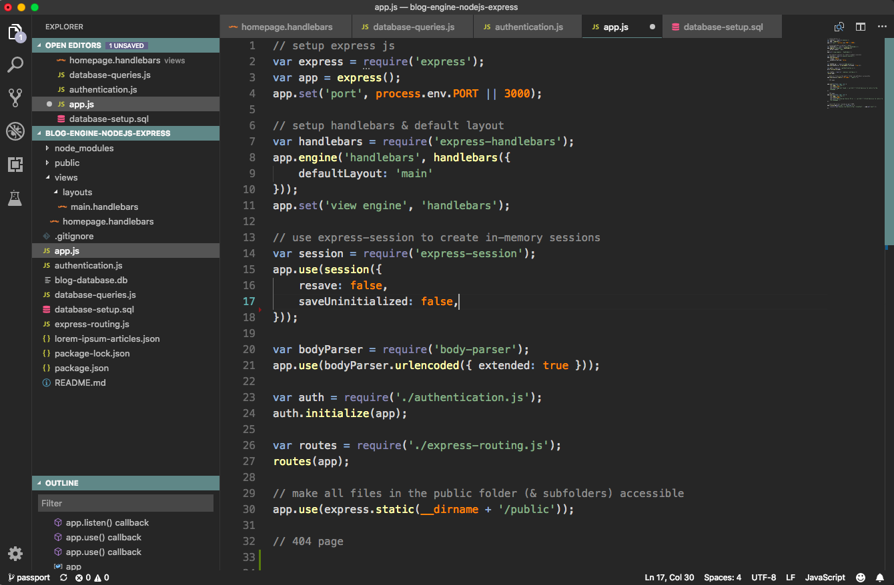
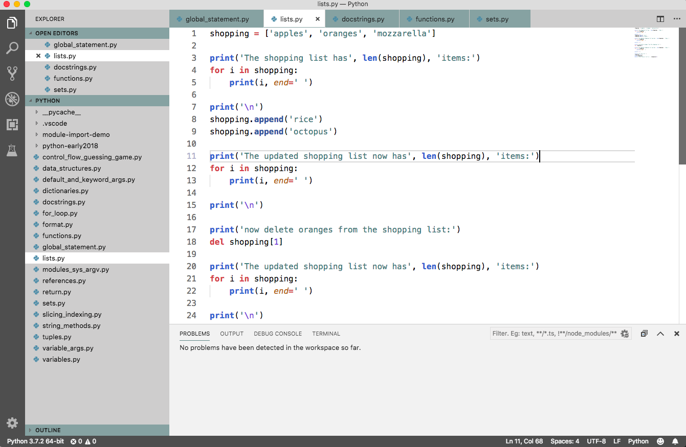

# Martin's theme for Visual Studio Code

Basic light & dark themes I made for use on my old Macbook Air.

## About:
* The dark and light themes use the settings defined in the [Dracula theme for Visual Studio Code](https://github.com/dracula/visual-studio-code) with a different colour palette applied.
* The editor colours for the dark theme uses the ['Apprentice' color scheme for Vim](https://github.com/romainl/Apprentice).

## Helpful resources:
* **Guides**:
    * [Create your own Color Theme for Visual Studio Code - Liv Erickson](https://livierickson.com/blog/create-your-own-color-theme-for-visual-studio-code/)
    * [Creating a VS Code Theme | CSS-Tricks - Sarah Drasner](https://css-tricks.com/creating-a-vs-code-theme/)
* [Visual Studio Code - Theme Color reference](https://code.visualstudio.com/api/references/theme-color)
* [Accessible Colors](http://accessible-colors.com) - for checking contrast of background/foreground colors.
* [Paletton - The Color Scheme Designer](http://paletton.com)
* [Adobe Color CC - Color Wheel](https://color.adobe.com/create/color-wheel/)

## Dark theme:

## Light theme:

End :)
